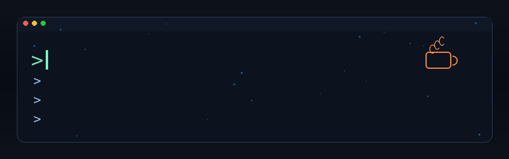

# ersulltansadykaliev



### Add this GIF to your GitHub README.md

1. Keep `assets/era-banner.gif` in your profile repository.
2. Add this line where you want the banner to appear:

```md

```

If you need to reference it from another repository, use the raw URL format:

```md

```